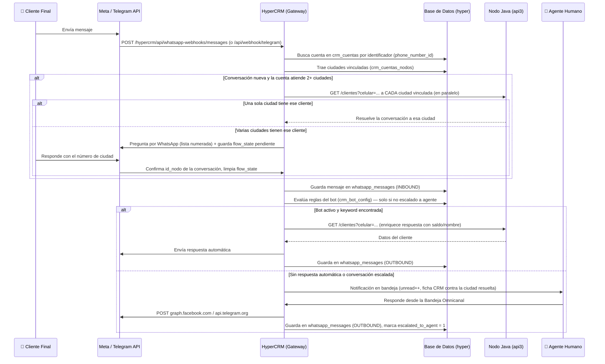

# HyperCRM — Diseño y Arquitectura

> [!IMPORTANT]
> Este documento es la **fuente de verdad** del sistema HyperCRM. Toda nueva funcionalidad debe alinearse con la arquitectura aquí descripta antes de ser implementada.

---

## 1. Objetivo del Proyecto

**HyperCRM** es una plataforma *Full-stack en Next.js* dedicada exclusivamente a la gestión omnicanal de mensajería (WhatsApp, Telegram, Messenger, Instagram).

Actúa como el **Gateway Central** del ecosistema HyperISP:
- Recibe y procesa todos los Webhooks de Meta y Telegram.
- Almacena el historial completo de mensajes en su propia base de datos.
- Responde automáticamente vía Bot configurable por sucursal.
- Permite a los agentes humanos tomar control de las conversaciones.
- Se conecta a los nodos Java (`api3`) para enriquecer respuestas con datos del cliente (saldo, planes, estado de servicio).

> [!TIP]
> **¿Por qué separarlo del EAR Java?**
> Evitamos saturar el sistema ISP principal con el alto tráfico de mensajería. El CRM tiene su propio ciclo de despliegue y escala independientemente.

---

## 2. Stack Tecnológico

| Capa | Tecnología | Detalle |
|------|-----------|---------|
| **Frontend** | Next.js 16 (App Router) + React | Tailwind CSS, Glassmorphism, diseño heredado de HyperISP |
| **Backend / API** | Next.js Route Handlers | Webhooks, Gateway Outbound, API interna de gestión |
| **Base de Datos** | MySQL/MariaDB (`hyper`) | Pool `mysql2`, conexión directa al servidor central |
| **Autenticación** | Cookie `hyperisp_session` + JWT | Roles: `ADMIN` / `USUARIO` con nodos asignados |
| **Integraciones** | Meta Graph API v19+ / Telegram Bot API | WhatsApp Cloud API, Messenger, Instagram, Telegram |

Las credenciales de conexión y tokens viven exclusivamente en `.env.local`.

---

## 3. Estructura del Proyecto

```text
hypercrm/
├── .env.local                        # Credenciales BD, tokens Meta/Telegram, JWT_SECRET
├── src/
│   ├── app/
│   │   ├── api/                      # Endpoints PÚBLICOS (webhooks, send, nodos, cuentas)
│   │   │   ├── nodos/                # CRUD de ciudades (filtrado por rol de usuario)
│   │   │   ├── cuentas/              # CRUD crm_cuentas + crm_cuentas_nodos (canal ↔ una o más ciudades)
│   │   │   │   └── [id]/             # PUT (editar, incluida la lista de ciudades) y DELETE
│   │   │   ├── send/                 # Gateway Outbound centralizado
│   │   │   └── webhook/
│   │   │       ├── meta/             # Inbound WhatsApp, Messenger, Instagram
│   │   │       └── telegram/         # Inbound Telegram (multii-bot)
│   │   └── hypercrm/                 # Área autenticada
│   │       ├── login/                # Pantalla de login del CRM
│   │       ├── dashboard/            # Panel principal con ciudades del usuario
│   │       ├── soporte/              # Bandeja Omnicanal de chats (con selector de número de WhatsApp)
│   │       ├── ciudades/             # ABM de Nodos
│   │       ├── numeros/              # Pantalla única de Números/Canales: ABM multi-canal y
│   │       │                         # multi-ciudad + los 3 métodos de alta de WhatsApp (manual,
│   │       │                         # OAuth de Meta, auto-sync) + estado Calling/SIP por número
│   │       ├── settings/             # Configuración: Bot, Telefonía, Telegram, Theme
│   │       │   └── whatsapp/         # Redirect a /hypercrm/numeros (unificado desde 2026-09-16)
│   │       ├── api/                  # Endpoints PROTEGIDOS (auth, system/info, user/theme)
│   │       │   └── whatsapp-config/  # OAuth/sync/manual de Meta + Calling/SIP (consumidos por numeros/)
│   │       │       └── ciudades.ts   # Helper compartido: vincula una cuenta a N ciudades
│   │       │                         # (crm_cuentas_nodos) desde los 3 flujos de alta
│   │       └── api/whatsapp-webhooks/messages/  # Webhook inbound de WhatsApp (mensajes + calls)
│   ├── components/
│   │   └── layout/                   # Sidebar, Header, ThemeModal
│   ├── context/
│   │   ├── AuthContext.jsx           # Proveedor de sesión y rol
│   │   ├── SoftphoneContext.tsx      # Softphone WebRTC (llamadas de WhatsApp vía SIP/Issabel)
│   │   └── ThemeContext.tsx          # Proveedor de tema visual
│   └── lib/
│       ├── db.ts                     # Pool MySQL compartido
│       ├── api.ts                    # Cliente Axios hacia api3 Java
│       └── getApiConfig.ts           # Lector de config de nodo activo
```

---

## 4. Modelo de Base de Datos

HyperCRM **nunca escribe datos de cliente** en otros sistemas. Sólo lee del `api3` del nodo correspondiente para enriquecer respuestas.

### Tablas Utilizadas

| Tabla | Tipo | Descripción |
|-------|------|-------------|
| `nodo` | Existente | Ciudades/sucursales: `id`, `nombre`, `endpoint` (URL del api3), `token`, `logo_url` |
| `usuario` | Existente | Operadores del CRM: incluye campo `nodos` (JSON array de IDs asignados) |
| `crm_cuentas` | Nueva | Una cuenta de canal (número de WhatsApp, bot de Telegram, etc.) |
| `crm_cuentas_nodos` | **Nueva (2026-09-16)** | Relación N a N: a qué ciudad(es) atiende cada cuenta |
| `crm_bot_config` | Nueva | Configuración del bot por nodo: preguntas, respuestas, estado activo/inactivo — **implementado**, ver §6 |
| `whatsapp_conversations` | Nueva | Una fila por conversación de WhatsApp (cliente ↔ número), con `id_nodo` resuelto y `flow_state` para flujos pendientes |
| `whatsapp_messages` | Nueva | Mensajes de WhatsApp (INBOUND/OUTBOUND), asociados a `whatsapp_conversations` |
| `crm_llamadas` | Nueva | Historial de llamadas por WhatsApp (Calling API vía SIP) |

> [!WARNING]
> La tabla `wapp_mensajes` mencionada en versiones previas de este documento **no es la que usa el código actual** del canal WhatsApp — es una tabla legacy que solo consume el bot de Telegram (`/api/webhook/telegram`). El log real de WhatsApp vive en `whatsapp_conversations` / `whatsapp_messages`.

### Tabla `crm_cuentas`

```sql
CREATE TABLE IF NOT EXISTS crm_cuentas (
  id             INT AUTO_INCREMENT PRIMARY KEY,
  id_nodo        INT NOT NULL,                        -- Ciudad "principal" (compatibilidad, ver nota)
  canal          VARCHAR(50) NOT NULL,                -- 'whatsapp' | 'telegram' | 'messenger' | 'instagram'
  identificador  VARCHAR(100) NOT NULL,               -- Phone Number ID (WA) o @bot_username (TG)
  waba_id        VARCHAR(100),                        -- WhatsApp Business Account ID (solo WhatsApp)
  token          VARCHAR(255) NOT NULL,               -- Access Token o Bot Token
  activo         TINYINT(1) DEFAULT 1,
  fecha_creacion TIMESTAMP DEFAULT CURRENT_TIMESTAMP,
  INDEX idx_nodo (id_nodo),
  UNIQUE KEY uq_identificador_canal (identificador, canal) -- agregada 2026-09-16
) ENGINE=InnoDB DEFAULT CHARSET=utf8mb4;
```

### Tabla `crm_cuentas_nodos` (2026-09-16)

```sql
CREATE TABLE IF NOT EXISTS crm_cuentas_nodos (
  id_cuenta INT NOT NULL,
  id_nodo   INT NOT NULL,
  PRIMARY KEY (id_cuenta, id_nodo),
  INDEX idx_nodo (id_nodo)
) ENGINE=InnoDB DEFAULT CHARSET=utf8mb4;
```

> [!NOTE]
> Un mismo número de WhatsApp (o bot de Telegram) puede atender **una o más ciudades**. La relación real vive acá; `crm_cuentas.id_nodo` queda como columna de compatibilidad (la ciudad de **menor id** entre las vinculadas) para el código que todavía no resuelve multi-ciudad. Se completa/actualiza automáticamente desde los tres flujos de alta de WhatsApp (manual, OAuth, auto-sync) y desde el CRUD de Números — ver §5bis.

### Tabla `crm_bot_config`

```sql
CREATE TABLE IF NOT EXISTS crm_bot_config (
  id          INT AUTO_INCREMENT PRIMARY KEY,
  id_nodo     INT NOT NULL,
  canal       VARCHAR(50) NOT NULL DEFAULT 'all',   -- 'all' | 'whatsapp' | 'telegram'
  pregunta    VARCHAR(255) NOT NULL,                 -- Texto o keyword que dispara la respuesta
  respuesta   TEXT NOT NULL,                         -- Texto de respuesta automática
  tipo        VARCHAR(50) DEFAULT 'keyword',         -- 'keyword' | 'intent' | 'default'
  activo      TINYINT(1) DEFAULT 1,
  orden       INT DEFAULT 0,                         -- Prioridad de evaluación
  INDEX idx_nodo_canal (id_nodo, canal)
) ENGINE=InnoDB DEFAULT CHARSET=utf8mb4;
```

### Tabla `whatsapp_conversations` (columnas relevantes)

| Columna | Uso |
|---------|-----|
| `id_nodo` | Ciudad resuelta de esta conversación (ver §5bis) |
| `phone_number` / `phone_number_id` | Celular del cliente y número de WhatsApp que recibió el mensaje |
| `escalated_to_agent` | Si un agente humano tomó la conversación (el bot y el ruteo automático dejan de intervenir) |
| `flow_state` | JSON libre para flujos pendientes de la conversación — hoy lo usa la desambiguación de ciudad (`{"tipo":"seleccion_ciudad","opciones":[...]}`) |

---

## 5. Flujo Bidireccional — Gateway Omnicanal



### A. Inbound — Mensajes Entrantes

1. El cliente envía un mensaje a WhatsApp, Telegram, Messenger o Instagram.
2. Meta/Telegram dispara el Webhook hacia `https://crm.hyperisp.com.ar/hypercrm/api/whatsapp-webhooks/messages` (o `/api/webhook/telegram`).
3. HyperCRM valida la firma HMAC (Meta) o el token del bot (Telegram).
4. Identifica la cuenta (número/bot) por `identificador` en `crm_cuentas`, y las ciudades vinculadas en `crm_cuentas_nodos`.
5. Si es una conversación nueva y el número atiende más de una ciudad, resuelve o pregunta cuál (ver §5bis).
6. Guarda el mensaje en `whatsapp_messages` como `INBOUND` (o en `wapp_mensajes` para el flujo legacy de Telegram).
7. Evalúa si hay una regla de bot activa → responde automáticamente o encola para agente (solo si la conversación no está `escalated_to_agent`).

### B. Outbound — Mensajes Salientes

1. El agente responde desde la **Bandeja Omnicanal** del CRM (con el selector de número de WhatsApp si el nodo tiene más de una línea activa).
2. HyperCRM despacha directo desde `soporte/actions.ts` (`enviarMensajeMeta`) — busca el token en `crm_cuentas` y llama a `graph.facebook.com`.
3. Guarda el mensaje en `whatsapp_messages` como `OUTBOUND` y marca `escalated_to_agent = 1` en la conversación (el bot deja de contestar ahí).

---

## 5bis. Multi-ciudad por número (2026-09-16)

> [!IMPORTANT]
> Un mismo número de WhatsApp (o bot de Telegram) puede atender más de una ciudad. Esto afecta tres partes del sistema que antes asumían "un número = una ciudad":

1. **CRUD de Números** (`/hypercrm/numeros`, pantalla única que reemplaza a la vieja `Settings > WhatsApp`): al dar de alta o editar un canal, se eligen una o más ciudades por checkbox. Los tres métodos de conexión de WhatsApp (Alta Manual, Auto-Sync leyendo Meta, Asistente OAuth) escriben en `crm_cuentas_nodos` a través del helper `whatsapp-config/ciudades.ts`. La tabla también expone el estado de Calling/SIP y permite borrar cualquier cuenta, sin restringir por la ciudad activa del admin.
2. **Webhook de mensajes** (`whatsapp-webhooks/messages/route.ts`): cuando llega el primer mensaje de un cliente a un número multi-ciudad, consulta el backend Java (`/clientes?celular=`) de cada ciudad vinculada en paralelo.
   - **1 coincidencia** → resuelve automático, la conversación queda con ese `id_nodo`.
   - **2+ coincidencias** → manda una lista numerada por WhatsApp y guarda `flow_state = {"tipo":"seleccion_ciudad","opciones":[...]}`; el próximo mensaje del cliente se interpreta como su respuesta.
   - **0 coincidencias** → sigue con la ciudad "principal" de compatibilidad (`crm_cuentas.id_nodo`, la de menor id entre las vinculadas).
   - Si un agente humano ya escaló la conversación (`escalated_to_agent = 1`), esta lógica se desactiva por completo — no le pisa la respuesta al agente.
3. **Ficha CRM en Soporte** (`soporte/actions.ts` → `getClienteByCelular`): consulta el backend Java de la ciudad ya resuelta de **esa conversación** (`whatsapp_conversations.id_nodo`), no la ciudad activa del agente logueado — antes podían no coincidir.

---

## 6. Motor de Bot — Clasificación y Respuestas Automáticas

> [!IMPORTANT]
> Cada ciudad puede configurar su propio conjunto de respuestas automáticas desde el módulo **Configuración → Bot** del CRM.

### Lógica de Evaluación (Switch de Intenciones)

Cuando llega un mensaje nuevo, el sistema ejecuta la siguiente lógica **en orden de prioridad**:

```
1. ¿El número remitente está en crm_cuentas? → identificar nodo(s)
2. ¿Existe una coincidencia de keyword en crm_bot_config para ese nodo? → responder
3. ¿El mensaje contiene una intent conocida? (saldo, reclamo, factura, etc.) → responder con datos del api3
4. ¿Ninguna coincidencia? → encolar como no leído para agente humano
```

### Intents Estándar (Configurables por Ciudad)

| Intent / Keyword | Acción del Bot | Fuente de Datos |
|-----------------|---------------|----------------|
| `saldo`, `deuda`, `cuánto debo` | Consulta saldo al api3 del nodo correspondiente | `api3/clientes?celular=...` |
| `factura`, `recibo` | Devuelve link o info de última factura | `api3/clientes/{id}/facturas` |
| `reclamo`, `problema`, `no funciona` | Abre ticket o deriva a agente | `api3/tickets` (POST) |
| `hola`, `buenas`, `buen día` | Saludo de bienvenida personalizado | Config local en `crm_bot_config` |
| `horario`, `atención` | Info de horarios de la sucursal | Config local en `crm_bot_config` |
| *(default)* | Mensaje de fallback + aviso a agente | Config local en `crm_bot_config` |

### Identificación del Cliente

Cuando el bot necesita datos del cliente:
1. Toma el número del remitente del mensaje entrante.
2. Llama al `endpoint` del nodo **ya resuelto de la conversación** (ver §5bis si el número atiende varias ciudades): `GET {endpoint}/clientes?celular={remitente}`.
3. Usa los datos para personalizar la respuesta (`Hola {nombre}, tu saldo actual es $X`) — solo si la plantilla de la regla usa `{nombre}` o `{saldo}`.
4. No hay caché: se consulta en vivo en cada respuesta del bot que necesite esos datos (el endpoint del nodo responde rápido, y cachear introduciría el riesgo de mostrar saldo desactualizado).

---

## 7. Módulos de la Plataforma — Estado de Implementación

| Módulo | Ruta | Estado |
|--------|------|--------|
| Login del CRM | `/hypercrm/login` | ✅ Implementado |
| Dashboard con ciudades del usuario | `/hypercrm/dashboard` | ✅ Implementado |
| Bandeja Omnicanal (chats) | `/hypercrm/soporte` | ✅ Implementado — selector de número de WhatsApp si el nodo tiene más de una línea |
| ABM de Ciudades (nodos) | `/hypercrm/ciudades` | ✅ Implementado |
| Números / Canales (multi-canal, multi-ciudad) | `/hypercrm/numeros` | ✅ Implementado — pantalla única (absorbió `settings/whatsapp`), Alta Manual / Auto-Sync / OAuth de Meta, estado Calling/SIP |
| Configuración Telegram | `/hypercrm/settings/telegram` | ✅ Implementado |
| ~~Configuración WhatsApp~~ | `/hypercrm/settings/whatsapp` | ↪️ Redirect a `/hypercrm/numeros` desde 2026-09-16 |
| Webhook Inbound Meta (WhatsApp multi-tenant + multi-ciudad) | `/hypercrm/api/whatsapp-webhooks/messages` | ✅ Implementado — ver §5bis |
| Webhook Inbound Telegram | `/api/webhook/telegram` | ✅ Implementado |
| Gateway Outbound (`/api/send`) | `/api/send` | ✅ Implementado |
| Motor de Bot / Intents (`crm_bot_config`) | `/hypercrm/settings/bot` | ✅ Implementado |
| ABM de Reglas del Bot | `/hypercrm/settings/bot` | ✅ Implementado |
| API Bot Config | `/api/bot-config` | ✅ Implementado |
| Llamadas por WhatsApp (Calling API vía SIP) | Softphone embebido + `crm_llamadas` | ✅ Implementado (ver `LLAMADA_POR_WHATSAPP_SIP.MD` para la referencia de la API de Meta) |
| Integración api3 para saldo/facturas | `soporte/actions.ts` | 🟡 Parcial — saldo y nombre sí, facturas no |
| Gestión de Usuarios del CRM | `/hypercrm/usuarios` | 🟡 Parcial |

---

## 8. Próximos Pasos de Desarrollo

- [x] ~~Crear tabla `crm_bot_config`~~ — implementado.
- [x] ~~ABM de reglas del Bot~~ — implementado (`/hypercrm/settings/bot`).
- [x] ~~Motor de evaluación en el webhook Inbound~~ — implementado (`evaluarBot` en `whatsapp-webhooks/messages/route.ts`).
- [x] ~~Notificaciones en tiempo real~~ — implementado vía Server-Sent Events (`/hypercrm/api/whatsapp-events`); el polling cada 15s queda como red de seguridad.
- [ ] **Enriquecimiento desde api3 más allá de saldo/nombre**: facturas y apertura de tickets desde el bot (intents "factura"/"reclamo" de la tabla de §6 son aspiracionales, no implementadas).
- [ ] **Gestión de Usuarios del CRM**: completar la asignación de nodos por usuario desde la UI de administración.
- [ ] **Enrutamiento multi-ciudad más allá del primer contacto**: hoy la desambiguación de ciudad (§5bis) solo corre al crear la conversación. Si el cliente en algún momento quiere consultar otra de sus ciudades vinculadas dentro de la misma conversación, no hay manera de volver a preguntar — el agente tendría que reasignar `id_nodo` a mano.
- [ ] **Timeout en las consultas de desambiguación**: `resolverCiudadCliente` no tiene timeout por ciudad — si el backend Java de una ciudad está caído/lento, demora la primera respuesta al cliente.
