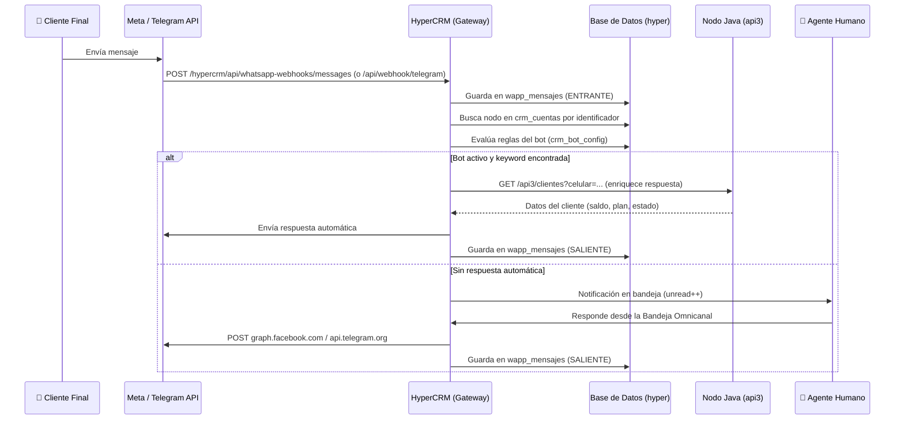

# HyperCRM — Diseño y Arquitectura

> [!IMPORTANT]
> Este documento es la **fuente de verdad** del sistema HyperCRM. Toda nueva funcionalidad debe alinearse con la arquitectura aquí descripta antes de ser implementada.

---

## 1. Objetivo del Proyecto

**HyperCRM** es una plataforma *Full-stack en Next.js* dedicada exclusivamente a la gestión omnicanal de mensajería (WhatsApp, Telegram, Messenger, Instagram).

Actúa como el **Gateway Central** del ecosistema HyperISP:
- Recibe y procesa todos los Webhooks de Meta y Telegram.
- Almacena el historial completo de mensajes en su propia base de datos.
- Responde automáticamente vía Bot configurable por sucursal.
- Permite a los agentes humanos tomar control de las conversaciones.
- Se conecta a los nodos Java (`api3`) para enriquecer respuestas con datos del cliente (saldo, planes, estado de servicio).

> [!TIP]
> **¿Por qué separarlo del EAR Java?**
> Evitamos saturar el sistema ISP principal con el alto tráfico de mensajería. El CRM tiene su propio ciclo de despliegue y escala independientemente.

---

## 2. Stack Tecnológico

| Capa | Tecnología | Detalle |
|------|-----------|---------|
| **Frontend** | Next.js 16 (App Router) + React | Tailwind CSS, Glassmorphism, diseño heredado de HyperISP |
| **Backend / API** | Next.js Route Handlers | Webhooks, Gateway Outbound, API interna de gestión |
| **Base de Datos** | MySQL/MariaDB (`hyper`) | Pool `mysql2`, conexión directa al servidor central |
| **Autenticación** | Cookie `hyperisp_session` + JWT | Roles: `ADMIN` / `USUARIO` con nodos asignados |
| **Integraciones** | Meta Graph API v19+ / Telegram Bot API | WhatsApp Cloud API, Messenger, Instagram, Telegram |

Las credenciales de conexión y tokens viven exclusivamente en `.env.local`.

---

## 3. Estructura del Proyecto

```text
hypercrm/
├── .env.local                        # Credenciales BD, tokens Meta/Telegram, JWT_SECRET
├── src/
│   ├── app/
│   │   ├── api/                      # Endpoints PÚBLICOS (webhooks, send, nodos, cuentas)
│   │   │   ├── nodos/                # CRUD de ciudades (filtrado por rol de usuario)
│   │   │   ├── cuentas/              # CRUD crm_cuentas (canal ↔ nodo)
│   │   │   ├── send/                 # Gateway Outbound centralizado
│   │   │   └── webhook/
│   │   │       ├── meta/             # Inbound WhatsApp, Messenger, Instagram
│   │   │       └── telegram/         # Inbound Telegram (multii-bot)
│   │   └── hypercrm/                 # Área autenticada
│   │       ├── login/                # Pantalla de login del CRM
│   │       ├── dashboard/            # Panel principal con ciudades del usuario
│   │       ├── soporte/              # Bandeja Omnicanal de chats
│   │       ├── ciudades/             # ABM de Nodos
│   │       ├── numeros/              # ABM de crm_cuentas
│   │       ├── settings/             # Configuración general, WhatsApp, Telegram
│   │       └── api/                  # Endpoints PROTEGIDOS (auth, system/info, user/theme)
│   ├── components/
│   │   └── layout/                   # Sidebar, Header, ThemeModal
│   ├── context/
│   │   ├── AuthContext.jsx           # Proveedor de sesión y rol
│   │   └── ThemeContext.tsx          # Proveedor de tema visual
│   └── lib/
│       ├── db.ts                     # Pool MySQL compartido
│       ├── api.ts                    # Cliente Axios hacia api3 Java
│       └── getApiConfig.ts           # Lector de config de nodo activo
```

---

## 4. Modelo de Base de Datos

HyperCRM **nunca escribe datos de cliente** en otros sistemas. Sólo lee del `api3` del nodo correspondiente para enriquecer respuestas.

### Tablas Utilizadas

| Tabla | Tipo | Descripción |
|-------|------|-------------|
| `nodo` | Existente | Ciudades/sucursales: `id`, `nombre`, `endpoint` (URL del api3), `token`, `logo_url` |
| `usuario` | Existente | Operadores del CRM: incluye campo `nodos` (JSON array de IDs asignados) |
| `wapp_mensajes` | Existente | Log centralizado de **todos** los mensajes entrantes y salientes de todos los canales |
| `crm_cuentas` | **Nueva** | Vincula canales de mensajería a nodos |
| `crm_bot_config` | **Nueva** | Configuración del bot por nodo: preguntas, respuestas, estado activo/inactivo |

### Tabla `crm_cuentas`

```sql
CREATE TABLE IF NOT EXISTS crm_cuentas (
  id             INT AUTO_INCREMENT PRIMARY KEY,
  id_nodo        INT NOT NULL,                        -- Ciudad a la que pertenece
  canal          VARCHAR(50) NOT NULL,                -- 'whatsapp' | 'telegram' | 'messenger' | 'instagram'
  identificador  VARCHAR(100) NOT NULL,               -- Phone Number ID (WA) o @bot_username (TG)
  token          VARCHAR(255) NOT NULL,               -- Access Token o Bot Token
  activo         TINYINT(1) DEFAULT 1,
  fecha_creacion TIMESTAMP DEFAULT CURRENT_TIMESTAMP,
  INDEX idx_nodo (id_nodo)
) ENGINE=InnoDB DEFAULT CHARSET=utf8mb4;
```

> [!NOTE]
> Un mismo número de WhatsApp o bot de Telegram puede estar asociado a **múltiples ciudades** si la empresa comparte canales entre sucursales. La lógica de ruteo identifica el nodo por el número *destinatario* del mensaje entrante.

### Tabla `crm_bot_config`

```sql
CREATE TABLE IF NOT EXISTS crm_bot_config (
  id          INT AUTO_INCREMENT PRIMARY KEY,
  id_nodo     INT NOT NULL,
  canal       VARCHAR(50) NOT NULL DEFAULT 'all',   -- 'all' | 'whatsapp' | 'telegram'
  pregunta    VARCHAR(255) NOT NULL,                 -- Texto o keyword que dispara la respuesta
  respuesta   TEXT NOT NULL,                         -- Texto de respuesta automática
  tipo        VARCHAR(50) DEFAULT 'keyword',         -- 'keyword' | 'intent' | 'default'
  activo      TINYINT(1) DEFAULT 1,
  orden       INT DEFAULT 0,                         -- Prioridad de evaluación
  INDEX idx_nodo_canal (id_nodo, canal)
) ENGINE=InnoDB DEFAULT CHARSET=utf8mb4;
```

---

## 5. Flujo Bidireccional — Gateway Omnicanal



### A. Inbound — Mensajes Entrantes

1. El cliente envía un mensaje a WhatsApp, Telegram, Messenger o Instagram.
2. Meta/Telegram dispara el Webhook hacia `https://crm.hyperisp.com.ar/hypercrm/api/whatsapp-webhooks/messages` (o `/api/webhook/telegram`).
3. HyperCRM valida la firma HMAC (Meta) o el token del bot (Telegram).
4. Guarda una copia en `wapp_mensajes` como `ENTRANTE`.
5. Identifica el nodo destino buscando el `identificador` en `crm_cuentas`.
6. Evalúa si hay una regla de bot activa → responde automáticamente o encola para agente.

### B. Outbound — Mensajes Salientes

1. El agente responde desde la **Bandeja Omnicanal** del CRM.
2. HyperCRM llama a `/api/send` con `{ canal, cuenta_emisora, destinatario, texto }`.
3. Busca el token en `crm_cuentas`, despacha hacia la API de Meta o Telegram.
4. Guarda el mensaje en `wapp_mensajes` como `SALIENTE`.

---

## 6. Motor de Bot — Clasificación y Respuestas Automáticas

> [!IMPORTANT]
> Cada ciudad puede configurar su propio conjunto de respuestas automáticas desde el módulo **Configuración → Bot** del CRM.

### Lógica de Evaluación (Switch de Intenciones)

Cuando llega un mensaje nuevo, el sistema ejecuta la siguiente lógica **en orden de prioridad**:

```
1. ¿El número remitente está en crm_cuentas? → identificar nodo(s)
2. ¿Existe una coincidencia de keyword en crm_bot_config para ese nodo? → responder
3. ¿El mensaje contiene una intent conocida? (saldo, reclamo, factura, etc.) → responder con datos del api3
4. ¿Ninguna coincidencia? → encolar como no leído para agente humano
```

### Intents Estándar (Configurables por Ciudad)

| Intent / Keyword | Acción del Bot | Fuente de Datos |
|-----------------|---------------|----------------|
| `saldo`, `deuda`, `cuánto debo` | Consulta saldo al api3 del nodo correspondiente | `api3/clientes?celular=...` |
| `factura`, `recibo` | Devuelve link o info de última factura | `api3/clientes/{id}/facturas` |
| `reclamo`, `problema`, `no funciona` | Abre ticket o deriva a agente | `api3/tickets` (POST) |
| `hola`, `buenas`, `buen día` | Saludo de bienvenida personalizado | Config local en `crm_bot_config` |
| `horario`, `atención` | Info de horarios de la sucursal | Config local en `crm_bot_config` |
| *(default)* | Mensaje de fallback + aviso a agente | Config local en `crm_bot_config` |

### Identificación del Cliente

Cuando el bot necesita datos del cliente:
1. Toma el número `remitente_nro` del mensaje entrante.
2. Llama al `endpoint` del nodo correspondiente: `GET {endpoint}/clientes?celular={remitente_nro}`.
3. **Cachea el resultado** en la tabla `wapp_mensajes` o en un campo extendido para evitar llamadas repetidas.
4. Usa los datos para personalizar la respuesta (`Hola {nombre}, tu saldo actual es $X`).

---

## 7. Módulos de la Plataforma — Estado de Implementación

| Módulo | Ruta | Estado |
|--------|------|--------|
| Login del CRM | `/hypercrm/login` | ✅ Implementado |
| Dashboard con ciudades del usuario | `/hypercrm/dashboard` | ✅ Implementado |
| Bandeja Omnicanal (chats) | `/hypercrm/soporte` | ✅ Implementado (desde BD local) |
| ABM de Ciudades (nodos) | `/hypercrm/ciudades` | ✅ Implementado |
| ABM de Canales (crm_cuentas) | `/hypercrm/numeros` | ✅ Implementado |
| Configuración Telegram | `/hypercrm/settings/telegram` | ✅ Implementado |
| Configuración WhatsApp | `/hypercrm/settings/whatsapp` | ✅ Implementado |
| Webhook Inbound Meta (WhatsApp multi-tenant) | `/hypercrm/api/whatsapp-webhooks/messages` | ✅ Implementado |
| Webhook Inbound Telegram | `/api/webhook/telegram` | ✅ Implementado |
| Gateway Outbound (`/api/send`) | `/api/send` | ✅ Implementado |
| **Motor de Bot / Intents** | `/hypercrm/settings/bot` | 🔴 **Pendiente** |
| **ABM de Reglas del Bot** | `/hypercrm/settings/bot` | 🔴 **Pendiente** |
| **API Bot Config** | `/api/bot-config` | 🔴 **Pendiente** |
| **Integración api3 para saldo/facturas** | `soporte/actions.ts` | 🟡 Parcial |
| Gestión de Usuarios del CRM | `/hypercrm/usuarios` | 🟡 Parcial |

---

## 8. Próximos Pasos de Desarrollo

- [ ] **Crear tabla `crm_bot_config`** en la BD de producción.
- [ ] **ABM de reglas del Bot** (`/hypercrm/settings/bot`): UI para que cada responsable de ciudad configure keywords/respuestas.
- [ ] **Motor de evaluación** en el webhook Inbound: ejecutar el switch de intents antes de encolar para agente.
- [ ] **Enriquecimiento desde api3**: cuando se identifica la intent "saldo" o "reclamo", llamar al nodo correspondiente y cachear la respuesta.
- [ ] **Notificaciones en tiempo real**: usar SSE o WebSockets para actualizar la bandeja sin polling cada 15s.
- [ ] **Gestión de Usuarios del CRM**: completar la asignación de nodos por usuario desde la UI de administración.
